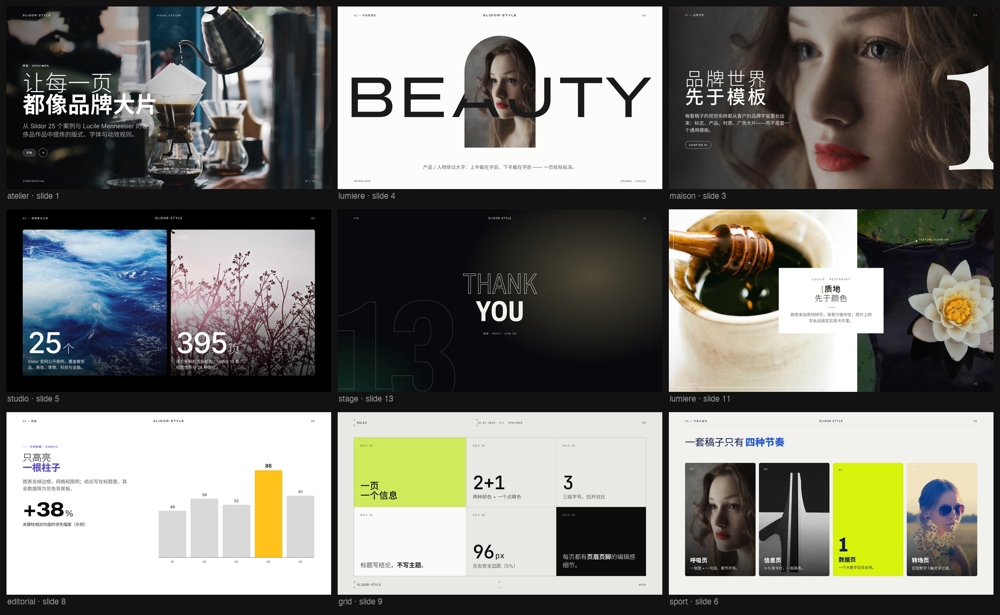
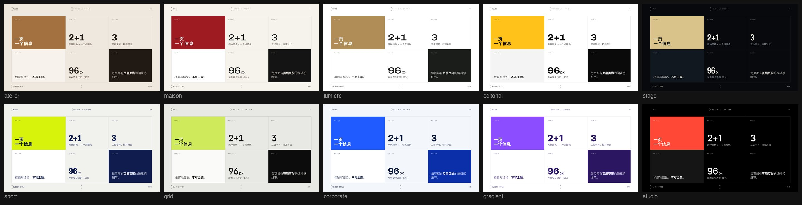
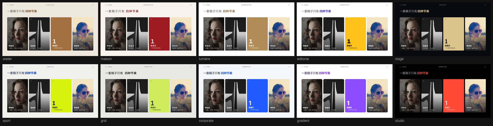
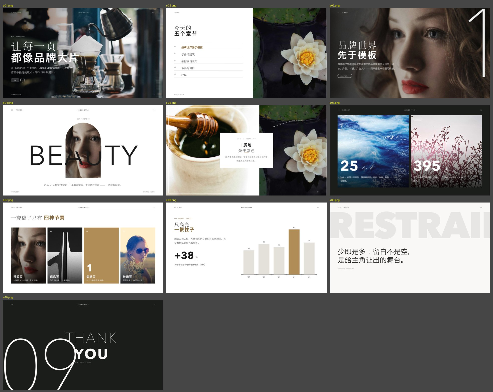

<div align="center">

# Slidor Style · a premium deck & web design skill for Claude

**A Claude skill that makes the slides and HTML pages Claude produces look like they came out of a Paris presentation studio — not a template.**

[中文](README.md) | English




</div>

## What it is

The working methods of two top presentation designers, turned into a design system Claude can follow:

- **[Slidor](https://www.slidor.agency/)** — Paris presentation design studio (Chanel, Cartier, LVMH, Nespresso, Lacoste, Tencent). Studied slide by slide: the 25 public case pages (395 slides), all 122 Dribbble shots and 54 methodology articles from their blog.
- **Lucile Mennessier** — French presentation designer for luxury and beauty houses (L'Oréal, Guerlain, Shiseido, Dom Pérignon). Studied 13 projects and two portfolio books.

The findings are written as rules, layouts and code. The point isn't the components but the few decisions that make a deck look premium: **brand world before template, one hero per slide, one message per slide, typography decides "premium", accent as a whisper**.

## What's inside

| | |
|---|---|
| **Method** | 8-step workflow (brand world → action titles → layouts → imagery → render QA); 14 "essence" rules, most learned from real client drafts that got rejected |
| **10 visual presets** | atelier (warm lifestyle) · maison (luxury editorial) · lumiere (beauty minimal) · editorial (fashion) · stage (dark keynote) · sport · grid (Swiss/tech) · corporate · gradient (product) · studio (Slidor's own look) |
| **24 layout archetypes** | cinematic cover, giant chapter numerals, interlock (object passing through a word), one-key-bar chart, triptych, Swiss modules… each with px specs on a 1920×1080 canvas |
| **HTML deck engine** | single file, auto-scaling, arrow keys, G overview, N notes, P preset switch, View Transitions morphs, print to PDF |
| **Scrolling page template** | responsive landing/report page with the same tokens and components |
| **PPTX toolchain** | pptxgenjs kit (same coordinate space and presets as the HTML engine) + Morph transitions + image prep (crop, rounded/arch frames, scrims, interlock split) |
| **Vector-text export** | `html_to_pptx_vector.py`: HTML deck → PPTX with a 4K picture layer and a vector SVG text layer — sharp at any zoom |
| **Render QA** | every slide rendered to PNG + contact sheet before delivery, blank-page detection |

### One slide, ten presets





### Editable PPTX (pptxgenjs kit, lumiere preset)



## Install

```bash
git clone https://github.com/njh20030605-code/slidor-style-skill.git
cp -R slidor-style-skill/slidor-style ~/.claude/skills/
```

Claude Code picks up `~/.claude/skills/slidor-style/SKILL.md` automatically. On claude.ai, zip the `slidor-style` folder and upload it as a custom skill.

Then just ask, e.g. "turn this report into a deck", "build a landing page for this product", "this deck looks cheap — redesign it".

### Requirements

| For | Needs |
|---|---|
| HTML rendering / screenshots / PDF | Google Chrome (scripts use the macOS path; change the `CHROME` variable elsewhere) |
| PPTX generation | Node.js + `npm i -g pptxgenjs` |
| Image prep, contact sheets | Python 3 + Pillow |
| Vector-text export | poppler (`pdftocairo`) |
| PPTX preview QA (optional) | LibreOffice (`soffice`) + poppler (`pdftoppm`) |

## Disclaimer

- Independent study project. **Not affiliated with or endorsed by Slidor, Lucile Mennessier or any brand mentioned.** Trademarks belong to their owners.
- The repository contains **no** images, files or copy from Slidor, Lucile Mennessier or their clients; `references/` holds my own observations of their public pages.
- Photos in the specimens and templates come from [Lorem Picsum](https://picsum.photos) (Unsplash images, used under the [Unsplash License](https://unsplash.com/license)).

## License

[MIT](LICENSE) © 2026 Jasper Yang
